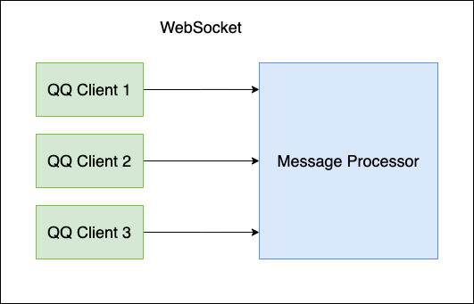

## 整体介绍



左侧为`QQ Client`(绿色)，右侧为`Message Processor`(蓝色)

`QQ Client`通过websocket连接到`Message Processor`

当`QQ Client`接收到某事件(私聊消息/群消息/加好友请求等)，通过websocket通知`Message Processor`处理

当`Message Processor`需要执行动作时(发送消息/踢人/禁言等)，通过websocket通知`QQ Client`执行

可以有多个`QQ Client`连接到同一个`Message Processor`，每个`QQ Client`对应一个QQ账号

## QQ Client

主要功能：
- 登陆
- 接受事件(Event)
- 执行动作(Api)

这一部分不需要自己编写，可选择以下任意一个下载并运行

- [Go-Mirai-Client](https://github.com/ProtobufBot/Go-Mirai-Client/releases)
    - 不需要任何环境，可以直接运行
    - 比较稳定
    - 只支持单账号登陆
- [Spring-Mirai-Client](https://github.com/ProtobufBot/Spring-Mirai-Client/releases)
    - 需要安装 JDK 1.8
    - 比较不稳定，可能收不到、发不出消息
    - 支持多账号登陆


## 消息处理器

建议使用[pbbot-spring-boot-starter](https://github.com/protobufbot/pbbot-spring-boot-starter)

Maven：

```xml
        <dependency>
            <groupId>net.lz1998</groupId>
            <artifactId>pbbot-spring-boot-starter</artifactId>
            <version>0.0.15</version>
        </dependency>
```

编写功能：

```java
package net.lz1998.pbbot.plugin;

import net.lz1998.pbbot.bot.Bot;
import net.lz1998.pbbot.bot.BotPlugin;
import onebot.OnebotEvent;
import org.jetbrains.annotations.NotNull;
import org.springframework.stereotype.Component;

import java.util.List;

@Component
public class HelloPlugin extends BotPlugin {
    @Override
    public int onGroupMessage(@NotNull Bot bot, @NotNull OnebotEvent.GroupMessageEvent event) {
        long groupId = event.getGroupId();
        String text = event.getRawMessage();
        if ("hello".equals(text)) {
            bot.sendGroupMsg(groupId, "hi", false);
        }
        return MESSAGE_BLOCK;
    }
}
```

配置application.yml

```yaml
spring:
  bot:
    plugin-list: # 配置插件列表（有序），如果插件返回0，继续执行剩余插件，如果插件返回1，终止剩余插件执行
      - net.lz1998.pbbot.plugin.HelloPlugin

server:
  port: 8081
```

## Websocket协议

连接时，Header Key：`x-self-id` Value：机器人账号

消息内容为二进制，使用proto定义：https://github.com/protobufbot/onebot_idl

:::warning 提示
不保证所有Event和Api都支持，只支持部分常用的，需要扩展可以加QQ群335783090讨论。
:::

### 机器人 Event
```protobuf
syntax = "proto3";
package onebot;
import "onebot_base.proto";

message PrivateMessageEvent{
    int64 time = 1;
    int64 self_id = 2;
    string post_type = 3;
    string message_type = 4;
    string sub_type = 5;
    int32 message_id = 6;
    int64 user_id = 7;
    repeated Message message = 8;
    string raw_message = 9;
    int32 font = 10;
    Sender sender = 11;
    message Sender{
        int64 user_id = 1;
        string nickname = 2;
        string sex = 3;
        int32 age = 4;
    }
    map<string, string> extra = 255;
}

message GroupMessageEvent{
    int64 time = 1;
    int64 self_id = 2;
    string post_type = 3;
    string message_type = 4;
    string sub_type = 5;
    int32 message_id = 6;
    int64 group_id = 7;
    int64 user_id = 8;
    Anonymous anonymous = 9;
    repeated Message message = 10;
    string raw_message = 11;
    int32 font = 12;
    Sender sender = 13;
    message Anonymous{
        int64 id = 1;
        string name = 2;
        string flag = 3;
    }
    message Sender{
        int64 user_id = 1;
        string nickname = 2;
        string card = 3;
        string sex = 4;
        int32 age = 5;
        string area = 6;
        string level = 7;
        string role = 8;
        string title = 9;
    }
    map<string, string> extra = 255;
}

message GroupUploadNoticeEvent{
    int64 time = 1;
    int64 self_id = 2;
    string post_type = 3;
    string notice_type = 4;
    int64 group_id = 5;
    int64 user_id = 6;
    File file = 7;
    message File{
        string id = 1;
        string name = 2;
        int64 size = 3;
        int64 busid = 4;
    }
    map<string, string> extra = 255;
}

message GroupAdminNoticeEvent{
    int64 time = 1;
    int64 self_id = 2;
    string post_type = 3;
    string notice_type = 4;
    string sub_type = 5;
    int64 group_id = 6;
    int64 user_id = 7;
    map<string, string> extra = 255;
}

message GroupDecreaseNoticeEvent{
    int64 time = 1;
    int64 self_id = 2;
    string post_type = 3;
    string notice_type = 4;
    string sub_type = 5;
    int64 group_id = 6;
    int64 operator_id = 7;
    int64 user_id = 8;
    map<string, string> extra = 255;
}

message GroupIncreaseNoticeEvent{
    int64 time = 1;
    int64 self_id = 2;
    string post_type = 3;
    string notice_type = 4;
    string sub_type = 5;
    int64 group_id = 6;
    int64 operator_id = 7;
    int64 user_id = 8;
    map<string, string> extra = 255;
}

message GroupBanNoticeEvent{
    int64 time = 1;
    int64 self_id = 2;
    string post_type = 3;
    string notice_type = 4;
    string sub_type = 5;
    int64 group_id = 6;
    int64 operator_id = 7;
    int64 user_id = 8;
    int64 duration = 9;
    map<string, string> extra = 255;
}

message FriendAddNoticeEvent{
    int64 time = 1;
    int64 self_id = 2;
    string post_type = 3;
    string notice_type = 4;
    int64 user_id = 5;
    map<string, string> extra = 255;
}

message GroupRecallNoticeEvent{
    int64 time = 1;
    int64 self_id = 2;
    string post_type = 3;
    string notice_type = 4;
    int64 group_id = 5;
    int64 user_id = 6;
    int64 operator_id = 7;
    int32 message_id = 8;
    map<string, string> extra = 255;
}

message FriendRecallNoticeEvent{
    int64 time = 1;
    int64 self_id = 2;
    string post_type = 3;
    string notice_type = 4;
    int64 user_id = 5;
    int32 message_id = 6;
    map<string, string> extra = 255;
}

message FriendRequestEvent{
    int64 time = 1;
    int64 self_id = 2;
    string post_type = 3;
    string request_type = 4;
    int64 user_id = 5;
    string comment = 6;
    string flag = 7;
    map<string, string> extra = 255;
}

message GroupRequestEvent{
    int64 time = 1;
    int64 self_id = 2;
    string post_type = 3;
    string request_type = 4;
    string sub_type = 5;
    int64 group_id = 6;
    int64 user_id = 7;
    string comment = 8;
    string flag = 9;
    map<string, string> extra = 255;
}
```

### 机器人Api
```protobuf
syntax = "proto3";
package onebot;
import "onebot_base.proto";


message SendPrivateMsgReq{
    int64 user_id = 1;
    repeated Message message = 2;
    bool auto_escape = 3;
}
message SendPrivateMsgResp{
    int32 message_id = 1;
}

message SendGroupMsgReq{
    int64 group_id = 1;
    repeated Message message = 2;
    bool auto_escape = 3;
}
message SendGroupMsgResp{
    int32 message_id = 1;
}

message SendMsgReq{
    string message_type = 1;
    int64 user_id = 2;
    int64 group_id = 3;
    repeated Message message = 4;
    bool auto_escape = 5;
}
message SendMsgResp{
    int32 message_id = 1;
}

message DeleteMsgReq{
    int32 message_id = 1;
}
message DeleteMsgResp{
}

message GetMsgReq{
    int32 message_id = 1;
}
message GetMsgResp{
    int32 time = 1;
    string message_type = 2;
    int32 message_id = 3;
    int32 real_id = 4;
    Sender sender = 5;
    repeated Message message = 6;
    string raw_message = 7;


    message Sender{
        int64 user_id = 1;
        string nickname = 2;
        string card = 3;
        string sex = 4;
        int32 age = 5;
        string area = 6;
        string level = 7;
        string role = 8;
        string title = 9;
    }
}

// TODO 暂时不支持
message GetForwardMsgReq{
    string id = 1;
}
message GetForwardMsgResp{
}

message SendLikeReq{
    int64 user_id = 1;
    int32 times = 2;
}
message SendLikeResp{
}

message SetGroupKickReq{
    int64 group_id = 1;
    int64 user_id = 2;
    bool reject_add_request = 3;
}
message SetGroupKickResp{
}

message SetGroupBanReq{
    int64 group_id = 1;
    int64 user_id = 2;
    int32 duration = 3;
}
message SetGroupBanResp{
}

message SetGroupAnonymousBanReq{
    int64 group_id = 1;
    Anonymous anonymous = 2;
    string anonymous_flag = 3;
    string flag = 4;
    int64 duration = 5;


    message Anonymous{
        int64 id = 1;
        string name = 2;
        string flag = 3;
    }
}
message SetGroupAnonymousBanResp{
}

message SetGroupWholeBanReq{
    int64 group_id = 1;
    bool enable = 2;
}
message SetGroupWholeBanResp{
}

message SetGroupAdminReq{
    int64 group_id = 1;
    int64 user_id = 2;
    bool enable = 3;
}
message SetGroupAdminResp{
}

message SetGroupAnonymousReq{
    int64 group_id = 1;
    bool enable = 2;
}
message SetGroupAnonymousResp{
}

message SetGroupCardReq{
    int64 group_id = 1;
    int64 user_id = 2;
    string card = 3;
}
message SetGroupCardResp{
}

message SetGroupNameReq{
    int64 group_id = 1;
    string group_name = 2;
}
message SetGroupNameResp{
}

message SetGroupLeaveReq{
    int64 group_id = 1;
    bool is_dismiss = 2;
}
message SetGroupLeaveResp{
}

message SetGroupSpecialTitleReq{
    int64 group_id = 1;
    int64 user_id = 2;
    string special_title = 3;
    int64 duration = 4;
}
message SetGroupSpecialTitleResp{
}

message SetFriendAddRequestReq{
    string flag = 1;
    bool approve = 2;
    string remark = 3;
}
message SetFriendAddRequestResp{
}

message SetGroupAddRequestReq{
    string flag = 1;
    string sub_type = 2;
    string type = 3;
    bool approve = 4;
    string reason = 5;
}
message SetGroupAddRequestResp{
}

message GetLoginInfoReq{
}
message GetLoginInfoResp{
    int64 user_id = 1;
    string nickname = 2;
}

message GetStrangerInfoReq{
    int64 user_id = 1;
    bool no_cache = 2;
}
message GetStrangerInfoResp{
    int64 user_id = 1;
    string nickname = 2;
    string sex = 3;
    int32 age = 4;
    int32 level = 5; // 扩展
    int64 login_days = 6; // 扩展
}

message GetFriendListReq{
}
message GetFriendListResp{
    repeated Friend friend = 1;


    message Friend{
        int64 user_id = 1;
        string nickname = 2;
        string remark = 3;
    }
}

message GetGroupInfoReq{
    int64 group_id = 1;
    bool no_cache = 2;
}
message GetGroupInfoResp{
    int64 group_id = 1;
    string group_name = 2;
    int32 member_count = 3;
    int32 max_member_count = 4;
}

message GetGroupListReq{
}
message GetGroupListResp{
    repeated Group group = 1;


    message Group{
        int64 group_id = 1;
        string group_name = 2;
        int32 member_count = 3;
        int32 max_member_count = 4;
    }
}

message GetGroupMemberInfoReq{
    int64 group_id = 1;
    int64 user_id = 2;
    bool no_cache = 3;
}
message GetGroupMemberInfoResp{
    int64 group_id = 1;
    int64 user_id = 2;
    string nickname = 3;
    string card = 4;
    string sex = 5;
    int32 age = 6;
    string area = 7;
    int64 join_time = 8;
    int64 last_sent_time = 9;
    string level = 10;
    string role = 11;
    bool unfriendly = 12;
    string title = 13;
    int64 title_expire_time = 14;
    bool card_changeable = 15;
}

message GetGroupMemberListReq{
    int64 group_id = 1;
}
message GetGroupMemberListResp{
    repeated GroupMember group_member = 1;


    message GroupMember{
        int64 group_id = 1;
        int64 user_id = 2;
        string nickname = 3;
        string card = 4;
        string sex = 5;
        int32 age = 6;
        string area = 7;
        int64 join_time = 8;
        int64 last_sent_time = 9;
        string level = 10;
        string role = 11;
        bool unfriendly = 12;
        string title = 13;
        int64 title_expire_time = 14;
        bool card_changeable = 15;
    }
}

message GetGroupHonorInfoReq{
    int64 group_id = 1;
    string type = 2;
}
message GetGroupHonorInfoResp{
    int64 group_id = 1;
    CurrentTalkative current_talkative = 2;
    repeated Honor talkative = 3;
    repeated Honor performer = 4;
    repeated Honor legend = 5;
    repeated Honor strong_newbie = 6;
    repeated Honor emotion = 7;


    message CurrentTalkative{
        int64 user_id = 1;
        string nickname = 2;
        string avatar = 3;
        int32 day_count = 4;
    }
    message Honor{
        int64 user_id = 1;
        string nickname = 2;
        string avatar = 3;
        string description = 4;
    }
}

message GetCookiesReq{
    string domain = 1;
}
message GetCookiesResp{
    string cookies = 1;
}

message GetCsrfTokenReq{
}
message GetCsrfTokenResp{
    int32 token = 1;
}

message GetCredentialsReq{
    string domain = 1;
}
message GetCredentialsResp{
    string cookies = 1;
    int32 csrf_token = 2;
}

message GetRecordReq{
    string file = 1;
    string out_format = 2;
}
message GetRecordResp{
    string file = 1;
}

message GetImageReq{
    string file = 1;
}
message GetImageResp{
    string file = 1;
}

message CanSendImageReq{
}
message CanSendImageResp{
    bool yes = 1;
}

message CanSendRecordReq{
}
message CanSendRecordResp{
    bool yes = 1;
}

message GetStatusReq{
}
message GetStatusResp{
    bool online = 1;
    bool good = 2;
}

message GetVersionInfoReq{
}
message GetVersionInfoResp{
    string app_name = 1;
    string app_version = 2;
    string protocol_version = 3;
    map<string, string> extra = 4;
}

message SetRestartReq{
    int32 delay = 1;
}
message SetRestartResp{
}

message CleanCacheReq{
}
message CleanCacheResp{
}
```
