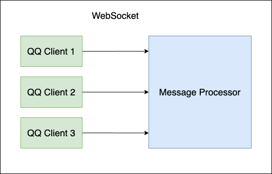

## 整体介绍

左侧为`QQ Client`(绿色)，右侧为`Message Processor`(蓝色)

`QQ Client`通过websocket连接到`Message Processor`

当`QQ Client`接收到某事件(私聊消息/群消息/加好友请求等)，通过websocket通知`Message Processor`处理

当`Message Processor`需要执行动作时(发送消息/踢人/禁言等)，通过websocket通知`QQ Client`执行

可以有多个`QQ Client`连接到同一个`Message Processor`，每个`QQ Client`对应一个QQ账号

### QQ Client

主要功能：
- 登陆
- 接受事件(Event)
- 执行动作(Api)

这一部分不需要自己编写，可选择以下任意一个下载并运行

- [Go-Mirai-Client](https://github.com/ProtobufBot/Go-Mirai-Client/releases)
    - 不需要任何环境，可以直接运行
    - 比较稳定
    - 只支持单账号登陆
- [Spring-Mirai-Client](https://github.com/ProtobufBot/Spring-Mirai-Client/releases)
    - 需要安装 JDK 1.8
    - 比较不稳定，可能收不到、发不出消息
    - 支持多账号登陆
