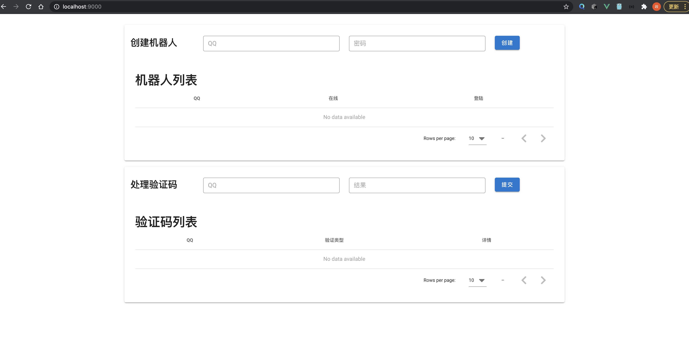
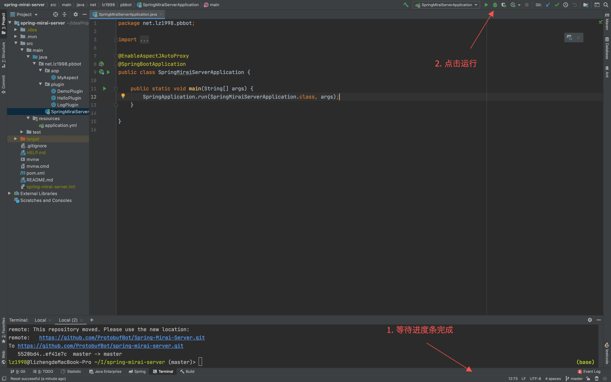

**QQ 机器人开发教程，hello world**

<!-- more -->

:::warning 环境配置
- [IDEA Intellij](https://www.jetbrains.com/idea/download/)
- JDK 1.8 (IDEA会自动配置)
- Maven (IDEA会自动配置)
- 可能因为某些原因导致国内速度较慢，需要自行解决
:::

## 运行 QQ Client

下载[Go-Mirai-Client](https://github.com/ProtobufBot/Go-Mirai-Client/releases)

解压后运行`Go-Mirai-Client-windows-amd64.exe`

:::tip 提示
看到Go不要害怕，不需要安装Go环境，这是已经编译后的可执行文件，可以直接双击运行(Windows)。

Linux需要先添加运行权限`chmod +x ./Go-Mirai-Client-<系统>`，然后运行`./Go-Mirai-Client-<系统>`
:::

浏览器打开 http://localhost:9000/ 

输入账号密码登陆，如果有验证码，在下方输入QQ和验证码。

**只能登陆一个QQ**，如需登陆多个需要多开。

也可以选择[Spring-Mirai-Client](https://github.com/ProtobufBot/Spring-Mirai-Client/releases)，可以多账号，但不稳定。

## 运行 Message Processor

下载[Spring-Mirai-Server](https://github.com/ProtobufBot/Spring-Mirai-Server/archive/master.zip)

使用IDEA打开`Spring-Mirai-Client`，等待右下角进度条完成

点击运行，在任意群发送`hello`，机器人回复`hi`

## 根据demo修改代码

代码位置：`src/main/java/net/lz1998/pbbot/plugin/HelloPlugin.java`

